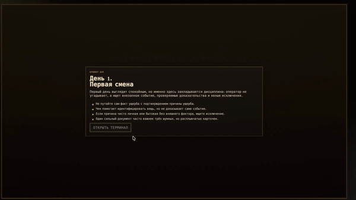

  

  

    

  
  
  
  

    

  <i>Уникальный симулятор страхового агента прямо в твоем браузере.</i>
  

---

## 🎮 Об игре

Получив задание, мы начали думать, как сделать теорию по страхованию интерактивной и интересной для молодой аудитории. Пришли в выводу, что наиболее наглядный и интересный способ - сделать целую игру! 

Вдохновившись сеттингом "Papers, Please!", пиксельными ассетами, мы создали по настоящему уникальный продукт! Который совмещает в себе интерактивный, интересный сюжет, основанный на качественной теории.

***

  

***
# https://notix3333.github.io/igsdeploy/ 

## 💻 Технологический стек

В основе проекта лежит современный и быстрый веб-стек, который позволяет с комфортом разрабатывать игру и гарантирует высокую производительность:

| Инструмент | Роль в проекте |
| :--- | :--- |
|  | **Основной язык логики.** Строгая типизация защищает от глупых багов при написании сложных игровых механик и сюжета. |
|  | **Сборщик платформы.** Обеспечивает молниеносный запуск и мгновенное обновление игры в браузере при редактировании кода. |
|  | **Менеджер пакетов.** Надежное управление всеми зависимостями и библиотеками проекта. |
|  | **Изолированное окружение.** Гарантирует, что проект абсолютно одинаково соберется и запустится на любом компьютере. |